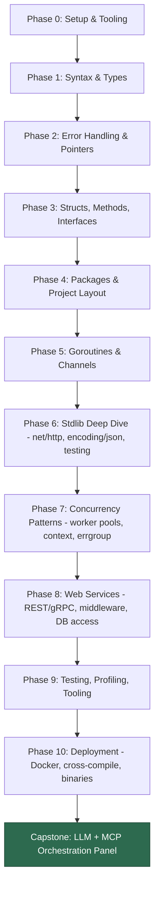

# Golang Journey — Roadmap (coming from JavaScript)

Mental model: you already know async I/O, event loops, and dynamic typing from JS.
Go's whole personality is the opposite of that — static types, explicit errors, no
exceptions, no classes, concurrency as a language primitive instead of a runtime trick.
Every phase below calls out the JS analogue so you can map new concepts onto what you
already know instead of learning from zero.

## Repo layout

One `go.mod` for the whole repo (already done). Every folder with its own
`main.go` is an independently runnable program — Go doesn't need a new module
per exercise the way Node needs a new `package.json` per project.

```
exercises/day-NN-topic/main.go   # small daily drills, run with: go run ./exercises/day-NN-topic
projects/NN-project-name/        # the 7-project ladder, each gets its own folder + README.md
```

Exercise folders are numbered/prefixed by day (`day-01-hello-world`,
`day-02-variables`, ...) so they sort chronologically and map 1:1 to the
day-by-day checklist below. `exercises/day-01-hello-world/main.go` is scaffolded
as the reference example.

## Flowchart



## Day-by-day schedule (1–2 hrs/day pace, ~9 weeks)

6 study days/week + 1 rest/catch-up day. Check boxes off as you go and commit —
that's your actual "journey" log. Each day maps back to a Phase above; see
**Phase-by-phase** below for the concept detail behind each line.

### Week 1 — Setup + Syntax & Types (Phase 0–1)
- [ ] **Day 1** — Install/tooling check, `go mod init`, Hello World, `go run`/`build`/`test`, VS Code Go extension.
- [ ] **Day 2** — Variables, constants, zero values, basic types, type conversion (no implicit coercion, unlike JS).
- [ ] **Day 3** — Control flow: `if`/`for`/`switch` (no `while`, no ternary `?:`).
- [ ] **Day 4** — Arrays vs slices deep dive: `append`, `len` vs `cap`, slicing gotchas (shared backing array).
- [ ] **Day 5** — Maps + struct basics (fields, zero-value structs).
- [ ] **Day 6** — Functions: multiple returns, variadic args, closures. Do 3–4 small exercises (e.g. FizzBuzz, word counter).
- [ ] **Day 7** — Rest / review. Skim what confused you on Days 1–6.

### Week 2 — Errors, Pointers, Structs, Interfaces (Phase 2–3) + Project 1
- [ ] **Day 8** — Error handling idioms: `errors.New`, `fmt.Errorf`, `%w` wrapping, `errors.Is`/`As`.
- [ ] **Day 9** — Pointers: `*T`/`&x`, value vs reference semantics, when a function needs a pointer receiver.
- [ ] **Day 10** — Structs & methods (value vs pointer receivers).
- [ ] **Day 11** — Interfaces (implicit satisfaction) + embedding/composition.
- [ ] **Day 12** — **Project 1: CLI task tracker** — build the core (add/list/complete tasks, JSON file persistence).
- [ ] **Day 13** — Finish Project 1: flags/`os.Args` for CLI args, write a couple of tests, polish.

### Week 3 — Packages, Stdlib Basics (Phase 4–6) + Project 2
- [ ] **Day 14** — Go modules deep dive, project layout (`cmd/`, `internal/`, `pkg/`), exported vs unexported names.
- [ ] **Day 15** — `encoding/json`: struct tags, `Marshal`/`Unmarshal`, nested structs.
- [ ] **Day 16** — `os`, `io`, `bufio` — file handling, reading stdin, buffered I/O.
- [ ] **Day 17** — `testing` package: table-driven tests, subtests, `t.Run`.
- [ ] **Day 18** — **Project 2: URL shortener** — basic `net/http` server, in-memory map + `sync.Mutex`.
- [ ] **Day 19** — Finish Project 2: add persistence (JSON file or SQLite), write handler tests.

### Week 4 — Goroutines & Channels (Phase 5, the big mental shift)
- [ ] **Day 20** — Goroutines basics: the `go` keyword, `sync.WaitGroup`.
- [ ] **Day 21** — Channels basics: unbuffered vs buffered, send/receive/close semantics.
- [ ] **Day 22** — `select` statement, common deadlocks and how to spot them.
- [ ] **Day 23** — `sync` package: `Mutex`, `RWMutex`, `Once`.
- [ ] **Day 24** — `context` package: cancellation, timeouts, passing request-scoped values.
- [ ] **Day 25** — Mini exercises: simple fan-in/fan-out, a goroutine-based counter with race detection (`go test -race`).

### Week 5 — Concurrency Patterns (Phase 7) + Project 3 start
- [ ] **Day 26** — Worker pool pattern (bounded concurrency over a task queue).
- [ ] **Day 27** — Pipeline pattern, `golang.org/x/sync/errgroup`.
- [ ] **Day 28** — **Project 3: REST API + DB** — schema design, `database/sql` + Postgres/SQLite driver setup.
- [ ] **Day 29** — Project 3: CRUD handlers wired to the DB.
- [ ] **Day 30** — Project 3: middleware (logging, recover-from-panic), request validation.
- [ ] **Day 31** — Project 3: tests for handlers + DB layer, wrap up.

### Week 6 — Web Services Deeper (Phase 8) + Project 4
- [ ] **Day 32** — `net/http` deep dive: middleware chaining, router comparison (stdlib mux vs `chi`/`gin`).
- [ ] **Day 33** — HTTP client timeouts, basic rate limiting (`x/time/rate`).
- [ ] **Day 34** — **Project 4: concurrent web scraper** — sequential version first, get it correct.
- [ ] **Day 35** — Project 4: parallelize with goroutines + worker pool, respect rate limits.
- [ ] **Day 36** — Project 4: error handling across goroutines, aggregate results, tests.
- [ ] **Day 37** — Buffer/review day — catch up or revisit anything shaky from Weeks 4–6.

### Week 7 — Testing/Profiling/Tooling (Phase 9) + Project 5
- [ ] **Day 38** — `go test -race`, benchmarks (`go test -bench`).
- [ ] **Day 39** — `pprof` basics — profile CPU/memory on Project 4's scraper.
- [ ] **Day 40** — `golangci-lint` setup, clean up lint warnings across all projects so far.
- [ ] **Day 41** — **Project 5: mini KV store over TCP** — `net` package, define a tiny wire protocol.
- [ ] **Day 42** — Project 5: concurrent client handling, in-memory store with `Mutex`.
- [ ] **Day 43** — Project 5: disk persistence (append-only log or periodic snapshot), tests.

### Week 8 — Deployment (Phase 10) + Capstone planning
- [ ] **Day 44** — Docker multi-stage builds for a Go binary.
- [ ] **Day 45** — Cross-compilation (`GOOS`/`GOARCH`), static binary builds.
- [ ] **Day 46** — Finish/polish Project 5, tag it as done.
- [ ] **Day 47** — Optional: `bubbletea` TUI basics (skip if going straight to a web UI for the capstone).
- [ ] **Day 48** — **Capstone planning**: sketch the panel's architecture — MCP client interface, LLM backend interface, how requests fan out/in.
- [ ] **Day 49** — Capstone planning: define the API surface (what the panel exposes to its UI/caller).

### Week 9+ — Capstone build (Phase Capstone)
- [ ] **Day 50** — Wire up one MCP client + one local LLM backend, end-to-end happy path only.
- [ ] **Day 51** — Add `context` cancellation/timeouts around the MCP + LLM calls.
- [ ] **Day 52** — Generalize the MCP client to an interface; add a second MCP server.
- [ ] **Day 53** — Generalize the LLM backend to an interface; swap between local models.
- [ ] **Day 54** — Fan-out across multiple MCPs concurrently, fan-in/aggregate results.
- [ ] **Day 55** — Error handling/resilience: one MCP or LLM failing shouldn't take down the panel.
- [ ] **Day 56+** — Iterate: this project graduates from "learning exercise" to your actual org tool from here.

## Phase-by-phase

### Phase 0 — Setup & Tooling
- Install: already done (Go 1.26.5 detected).
- `go mod init`, understand modules (this replaces `package.json` + npm registry —
  no central registry, modules are fetched by git URL/proxy).
- Editor: VS Code + Go extension (gopls, delve debugger, gofmt-on-save).
- Learn the trio you'll run constantly: `go run`, `go build`, `go test`.

### Phase 1 — Syntax & Types
- Static typing, `var`/`:=`, zero values (no `undefined`/`null` ambiguity — every
  type has a concrete zero value).
- Arrays vs **slices** (slices ≈ JS arrays but backed by a fixed array + growth
  semantics — this trips up everyone coming from JS, spend real time here).
- Maps (≈ JS `Object`/`Map`), but no guaranteed iteration order.
- Functions: multiple return values (this is how errors work — no try/catch),
  no default params, no overloading.

### Phase 2 — Error Handling & Pointers
- Errors are values, returned explicitly (`if err != nil`) — mentally replace every
  `try/catch` habit with "check the second return value."
- Pointers (`*T`, `&x`) — JS objects are always reference types; Go lets you choose
  value vs pointer semantics explicitly. This is the biggest new concept for you.
- `panic`/`recover` exist but are NOT your error handling mechanism — don't reach
  for them like `throw`.

### Phase 3 — Structs, Methods, Interfaces
- Structs ≈ plain JS objects/classes without inheritance.
- Methods with value vs pointer receivers (decides if mutation is visible to caller).
- Interfaces are satisfied **implicitly** (structural typing, like TypeScript
  interfaces but even looser — no `implements` keyword).
- Embedding (composition) instead of class inheritance.

### Phase 4 — Packages & Project Layout
- Conventional layout: `cmd/`, `internal/`, `pkg/`, `go.mod` at root.
- Exported vs unexported identifiers via capitalization (`Foo` public, `foo` private)
  instead of `export`/explicit visibility keywords.

### Phase 5 — Goroutines & Channels (the big one)
- Goroutines ≈ lightweight threads, not Promises — you `go func(){}()` and it runs
  concurrently on Go's own scheduler (M:N threading), not the single-threaded event
  loop you're used to.
- Channels are typed pipes for communicating between goroutines — think of them as
  a blocking queue, very unlike anything in JS.
- `select` ≈ `Promise.race`-ish, but for channels.
- This is where "coming from JS" stops helping and Go's actual value prop starts.

### Phase 6 — Stdlib Deep Dive
- `net/http` (build a server with zero dependencies — no Express needed).
- `encoding/json` (struct tags ≈ JSON (de)serialization, similar shape to
  class-validator/decorators but via tags).
- `testing` package — table-driven tests are idiomatic here, no Jest/Mocha.
- `context` package — cancellation/timeouts/request-scoped values, threaded
  explicitly through every function signature (JS hides this in Promise chains).

### Phase 7 — Concurrency Patterns
- Worker pools, fan-in/fan-out, pipelines.
- `sync.WaitGroup`, `sync.Mutex`, `errgroup.Group`.
- Context cancellation propagation across goroutines.

### Phase 8 — Web Services
- Router: start with stdlib `net/http` mux, then try `chi` or `gin`.
- Middleware pattern (closures wrapping `http.Handler`).
- DB access: `database/sql` + driver, then `sqlx` or `gorm`; migrations via `goose`
  or `golang-migrate`.
- gRPC + protobuf once REST feels boring.

### Phase 9 — Testing, Profiling, Tooling
- `go test -race` (catches data races — use this constantly once you touch goroutines).
- Benchmarks (`go test -bench`), `pprof` for profiling.
- `golangci-lint` for linting.

### Phase 10 — Deployment
- Static binary builds, cross-compilation (`GOOS`/`GOARCH`) — no `node_modules`,
  no runtime needed on the target machine, single binary ships.
- Docker multi-stage builds (tiny final images since Go binaries are static).

### Capstone — LLM + MCP Orchestration Panel
This is where the "org repo" project lands. Treat it as the integration point for
everything above:
- Goroutines/channels → orchestrating multiple MCP server calls concurrently.
- `context` → cancellation/timeouts when a local LLM or MCP server hangs.
- Interfaces → abstracting "MCP client" / "LLM backend" so you can swap local models.
- `net/http` → the panel's own API/UI backend (pair with a JS/React frontend — your
  existing strength).
- Worker pools → fan-out requests across multiple MCPs, fan-in results.

## Project ladder (do these roughly in order)

1. **CLI task tracker** — flags/`os.Args`, file persistence (JSON), no deps.
   Teaches: syntax, structs, JSON, file I/O.
2. **In-memory URL shortener (HTTP API)** — `net/http`, maps, `sync.Mutex`.
   Teaches: stdlib HTTP, concurrency-safety basics.
3. **REST API with a real DB** (notes/bookstore app) — `net/http` or `chi`,
   Postgres via `database/sql`.
   Teaches: layered architecture, DB access, testing handlers.
4. **Concurrent web scraper/crawler** — goroutines + channels + worker pool,
   rate limiting.
   Teaches: Phase 5–7 concurrency patterns for real.
5. **Mini key-value store server** (Redis-lite) over TCP — `net`, custom protocol,
   persistence to disk.
   Teaches: raw networking, concurrency, protocol design.
6. **TUI dashboard** using `bubbletea` — could be a dry run for the MCP panel's UI
   if you want a terminal-first version before a web UI.
7. **Capstone: Local LLM + MCP orchestration panel** — ties everything together;
   build incrementally (start with one MCP + one local model, then generalize to
   a registry/panel of both).

## Resources

Keep these three open as permanent tabs — they cover 80% of day-to-day lookups:
- **[A Tour of Go](https://go.dev/tour/)** — official, interactive, in-browser. Do this alongside Weeks 1–2.
- **[Go by Example](https://gobyexample.com/)** — one page per topic with runnable snippets. Best quick reference while working through any day above.
- **[pkg.go.dev](https://pkg.go.dev/std)** — stdlib docs. This is your MDN.

### Per-phase resources

**Phase 0–1 (Setup, Syntax & Types)**
- [Effective Go](https://go.dev/doc/effective_go) — official idioms doc, skim early, re-read after Week 2 when it'll mean more.
- [Go Tour: Slices](https://go.dev/tour/moretypes/7) + [Go blog: Slices, usage and internals](https://go.dev/blog/slices-intro) — the slice-semantics gotcha deserves this dedicated read.

**Phase 2–3 (Errors, Pointers, Structs, Interfaces)**
- [Go blog: Error handling and Go](https://go.dev/blog/error-handling-and-go)
- [Go blog: Errors are values](https://go.dev/blog/errors-are-values)
- Book: *[Learning Go](https://www.oreilly.com/library/view/learning-go/9781492077206/)* by Jon Bodner — best single book for someone coming from another language; covers interfaces/structs/generics cleanly.

**Phase 4 (Packages & Project Layout)**
- [Go blog: Organizing a Go module](https://go.dev/doc/modules/layout)
- [golang-standards/project-layout](https://github.com/golang-standards/project-layout) (community convention, not official, but widely copied)

**Phase 5 (Goroutines & Channels — the big one)**
- [Go Tour: Concurrency](https://go.dev/tour/concurrency/1)
- [Go blog: Go Concurrency Patterns (Rob Pike, Google I/O talk)](https://go.dev/blog/io2013-talk-concurrency-patterns) — watch the talk, not just the slides.
- Book: *[Concurrency in Go](https://www.oreilly.com/library/view/concurrency-in-go/9781491941294/)* by Katherine Cox-Buday — the definitive concurrency book, read this during/after Week 4.

**Phase 6–7 (Stdlib, Concurrency Patterns)**
- [Go blog: Go Concurrency Patterns: Pipelines and cancellation](https://go.dev/blog/pipelines)
- [Go blog: Context](https://go.dev/blog/context)
- [gophercises](https://gophercises.com/) (free, by Jon Calhoun) — exercise-driven, several map directly onto the project ladder (URL shortener, quiz game, task manager).

**Phase 8 (Web Services)**
- Book/site: *[Let's Go](https://lets-go.alexedwards.net/)* by Alex Edwards — best resource specifically for building a real REST service in idiomatic Go (routing, middleware, DB, sessions). Worth the price if you want Project 3 to feel production-shaped.
- [go-chi/chi docs](https://github.com/go-chi/chi) — lightweight router, good stdlib-adjacent middle ground before gin.
- [database/sql tutorial](https://go.dev/doc/database/index) (official).

**Phase 9 (Testing, Profiling, Tooling)**
- [Go blog: Profiling Go Programs](https://go.dev/blog/pprof)
- [Go wiki: Table Driven Tests](https://go.dev/wiki/TableDrivenTests)
- Book: *[100 Go Mistakes and How to Avoid Them](https://100go.co/)* by Teiva Harsanyi — read this after you have a few projects done; it'll reframe mistakes you already made.

**Phase 10 (Deployment)**
- [Docker's official Go language guide](https://docs.docker.com/language/golang/)
- [Go blog: Optimizing Go binary size / cross-compilation basics](https://go.dev/doc/install/source#environment) (`GOOS`/`GOARCH` reference)

**Capstone (LLM + MCP panel)**
- [Model Context Protocol docs](https://modelcontextprotocol.io/) — spec + concepts, provider-agnostic.
- [mark3labs/mcp-go](https://github.com/mark3labs/mcp-go) — the most widely used community Go SDK for MCP servers/clients.
- [Ollama API docs](https://github.com/ollama/ollama/blob/main/docs/api.md) — if the local LLMs you're orchestrating run through Ollama.

### If you want structured/paid courses instead of books
- [Boot.dev's Go course](https://www.boot.dev/tracks/backend) — interactive, project-driven, explicitly designed for people switching from another language.
- [Exercism's Go track](https://exercism.org/tracks/go) — free, mentored code exercises with real feedback, good supplement alongside the day-by-day schedule.

## Suggested next step
Scaffold Phase 0–1 now: `go mod init`, a `cmd/` layout, and project #1 (CLI task
tracker) as the first hands-on rep. Say the word and I'll set that up.
